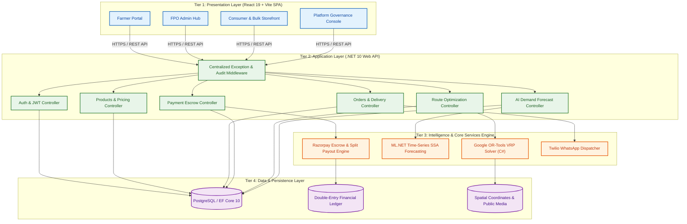
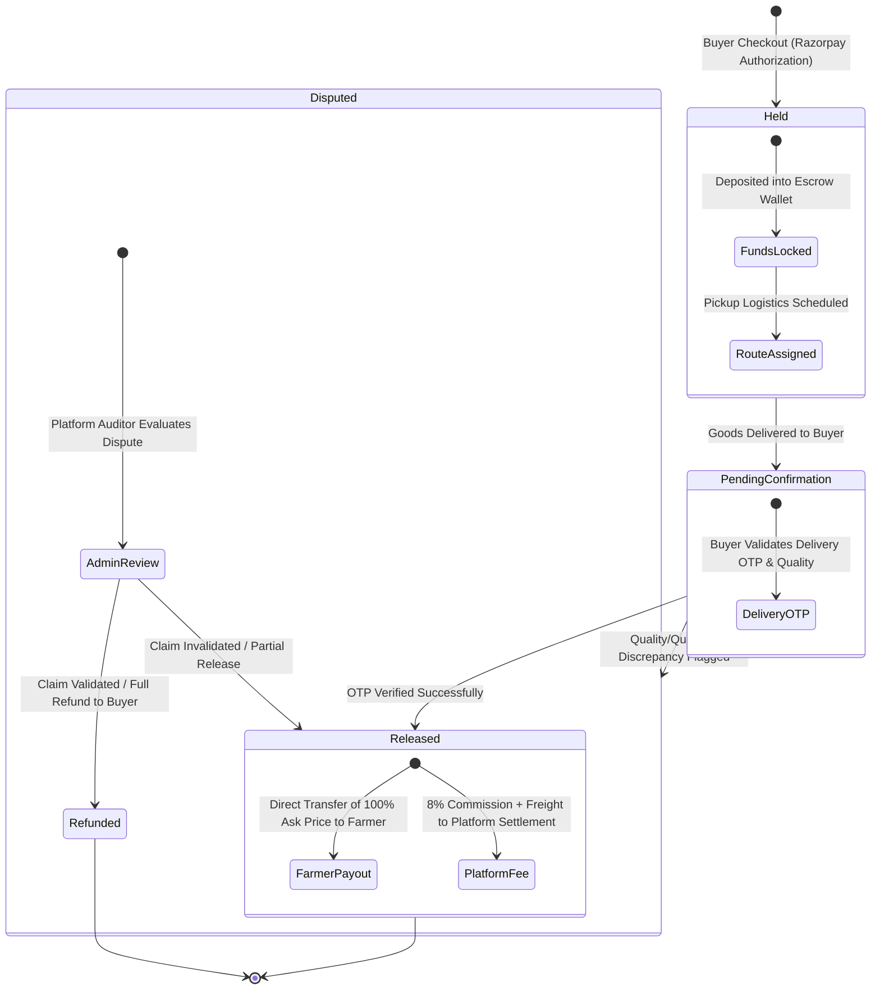

<div align="center">

# 🌾 FasalConnect (Farmer Marketplace)

**Direct Farmer-to-Consumer & Bulk Buyer Marketplace with Escrow Payments, AI Demand Forecasting, and Multi-Pickup Route Optimization**

*Developed by **Team Zenith** | Submitted for **Smart India Hackathon (SIH)** | **Ministry of Consumer Affairs, Food & Public Distribution***

---

[](https://dotnet.microsoft.com/)
[](https://react.dev/)
[](https://vitejs.dev/)
[](https://tailwindcss.com/)
[](https://www.postgresql.org/)
[](https://developers.google.com/optimization)
[](https://dotnet.microsoft.com/apps/machinelearning-ai/ml-dotnet)
[](https://razorpay.com/)

</div>

---

## 📌 Executive Summary & Problem Statement

In traditional agricultural supply chains across India, smallholder farmers lose up to **35-50% of produce value** to middleman arbitrage, inefficient multi-tiered distribution, and delayed payment cycles. Consumers and bulk institutional buyers (restaurants, retail chains, food processors) pay inflated prices while farmers receive below-cost returns.

**FasalConnect** is an enterprise-grade digital marketplace platform built to dismantle middleman exploitation by connecting farmers and Farmer Producer Organizations (FPOs) directly with consumers and bulk buyers.

### Key Innovations
- 🛡️ **Guaranteed 100% Ask Price via Financial Escrow**: Buyer payments are authorized into a secure platform escrow wallet and split-released via Razorpay Route upon verified OTP delivery. Farmers receive 100% of their listed asking price.
- 🚚 **Dynamic Multi-Farmer Route Optimization**: Powered by **Google OR-Tools Vehicle Routing Problem (VRP)** solver, optimizing collection routes across fragmented rural farms to minimize logistics costs and carbon footprint.
- 📈 **AI Pre-Planting Demand & Price Forecasting**: Powered by **ML.NET SSA Time-Series** models, analyzing historical Mandi trends to guide farmers on optimal crop selection and harvest timing.
- 🌐 **Multilingual & Rural Access**: Native multi-lingual interface (English, Hindi, Marathi, Tamil) integrated with **Twilio WhatsApp** notification channels for low-connectivity rural onboarding.

---

## 🏛️ System Architecture

FasalConnect utilizes a decoupled, high-performance architecture comprising a **React 19 SPA frontend**, an **ASP.NET Core 10 Web API backend**, an **OR-Tools & ML.NET intelligence engine**, and an **Immutable Double-Entry Financial Ledger**.



---

## 🔄 End-to-End Core Workflows

### 1. Product Listing to Delivery & Escrow Settlement

```mermaid
sequenceDiagram
    autonumber
    actor Farmer as Farmer / FPO Producer
    actor Buyer as Consumer / Bulk Buyer
    participant Frontend as React SPA Frontend
    participant Backend as .NET 10 Web API
    participant ORTools as Google OR-Tools Engine
    participant Escrow as Payment Escrow Engine
    participant DB as PostgreSQL Database

    %% Step 1: Pre-Planting Forecast
    Farmer->>Frontend: Request Crop Demand Insights
    Frontend->>Backend: GET /api/forecast/crop/Tomatoes
    Backend-->>Frontend: Return ML.NET 30-Day Forecast & Price Band
    
    %% Step 2: Product Listing
    Farmer->>Frontend: List Produce (Sets 100% Ask Price)
    Frontend->>Backend: POST /api/products
    Backend->>DB: Insert Product Record (Status = Active)

    %% Step 3: Order Placement & Escrow Deposit
    Buyer->>Frontend: Add to Cart & Proceed to Checkout
    Frontend->>Backend: POST /api/orders
    Backend->>Backend: Compute Final Price: Ask Price + 8% Platform Fee + Freight + 2% Gateway
    Backend->>Escrow: Deposit & Hold Funds in Escrow Wallet
    Backend->>DB: Record Order & Immutable Ledger Entry (Status = HELD)

    %% Step 4: Multi-Pickup Route Optimization
    Backend->>ORTools: Trigger Route Optimization (POST /api/routes/optimize)
    Note over ORTools: Build Haversine Distance Matrix & Solve VRP
    ORTools-->>Backend: Return Optimized Vehicle Pickup Manifest & ETAs
    Backend->>DB: Save Delivery Routes & Fleet Assignments

    %% Step 5: Verification & Instant Farmer Payout
    Note over Farmer,Buyer: Produce Delivered; Buyer Verifies OTP & Weight
    Buyer->>Frontend: Confirm Delivery Receipt
    Frontend->>Backend: POST /api/payments/confirm-delivery
    Backend->>Escrow: Release Escrow Lock (Status = RELEASED)
    Escrow->>Farmer: Instant Transfer of 100% Ask Price (UPI / Direct Bank)
    Backend->>DB: Complete Ledger Entry (Payout Settlement)
```

---

## 💰 Financial Model & Escrow Mechanics

### Transparent Pricing Formula

$$\text{Platform Commission} = \text{Farmer Ask Price} \times 8\%$$

$$\text{Logistics Charge} = \text{Base Freight} + \text{Distance Surcharge}$$

$$\text{Consumer Checkout Total} = \left( (\text{Farmer Ask Price} + \text{Platform Commission} + \text{Logistics Charge}) \times \text{Quantity} \right) \times 1.02$$

### Financial State Machine



---

## 🌟 Key Platform Modules & Features

| Portal | Key Capabilities |
|---|---|
| **🌾 Farmer Portal** | Produce inventory management, 100% ask price listing, AI demand forecast insights, earnings dashboard, order tracking, WhatsApp automated alerts. |
| **🏬 Consumer & Bulk Buyer Storefront** | Product catalog search & filtering, bulk order volume discounting, integrated Leaflet map for farm origin tracking, Razorpay checkout, delivery verification OTP. |
| **🚜 FPO Admin Hub** | Aggregated member inventory management, bulk listing synchronization, consolidated financial payout reporting, sub-farmer link management. |
| **🛡️ Platform Governance Console** | Order audit logs, vehicle route solver triggering, escrow fund ledger monitoring, platform fee configuration, dispute resolution management. |

---

## 💻 Tech Stack Specification

| Category | Technology / Library | Version | Purpose |
|---|---|---|---|
| **Backend Framework** | ASP.NET Core Web API | `.NET 10.0` | High-performance API backend & micro-services host |
| **Frontend Framework** | React + Vite | `React 19` / `Vite 8` | Modern SPA user interface |
| **Styling & UI** | Tailwind CSS v4 + Lucide Icons | `v4.3` | Dark/emerald glassmorphic design system |
| **Database & ORM** | PostgreSQL + EF Core | `16.0` / `10.0` | Relational storage & double-entry financial ledger |
| **Route Optimization** | Google.OrTools | `9.15` | Vehicle Routing Problem (VRP) solver |
| **Demand Forecasting** | ML.NET TimeSeries (SSA) | `5.0` | Time-series Singular Spectrum Analysis demand models |
| **Payment Gateway** | Razorpay SDK | `3.3` | Test mode escrow & split payouts (Razorpay Route) |
| **Notifications** | Twilio WhatsApp API | `8.0` | WhatsApp notifications & offline onboarding |
| **Maps & Spatial** | Leaflet.js / React-Leaflet | `1.9` / `5.0` | Interactive spatial maps for pickup & delivery routes |
| **Internationalization** | react-i18next | `17.0` | English, Hindi (हिंदी), Marathi (मराठी), Tamil (தமிழ்) |

---

## 📁 Repository Structure

```
fasalConnect/
├── backend/
│   └── FarmerMarketplace.Api/            # ASP.NET Core 10 Web API
│       ├── Controllers/                  # Auth, Products, Orders, Escrow, Routes, Forecast, Admin, WhatsApp
│       ├── Services/                     # Business Logic (RouteService, PaymentEscrowService, ForecastService, etc.)
│       ├── Interfaces/                   # Service Contracts (IAuthService, IPaymentEscrowService, etc.)
│       ├── Models/                       # EF Core Entities (User, Product, Order, EscrowTransaction, DeliveryRoute)
│       ├── DTOs/                         # Feature Request/Response Data Transfer Objects
│       ├── Data/                         # AppDbContext & EF Core Migrations
│       ├── Security/                     # JwtService & BCrypt Hashing
│       ├── Middleware/                   # ExceptionMiddleware (Centralized Error & Audit Handler)
│       ├── Utils/                        # Haversine Distance Calculation & Spatial Helpers
│       └── Program.cs                    # Application Entrypoint & DI Configuration
│
├── frontend/                             # React 19 + Vite Frontend SPA
│   └── src/
│       ├── pages/                        # Role-based views: farmer/, buyer/, fpo-admin/, admin/, auth/
│       ├── components/                   # UI components: product/, order/, payment/, forecast/, map/
│       ├── context/                      # Global State: AuthContext, CartContext, LanguageContext
│       ├── services/                     # Axios API Service Layer
│       ├── routes/                       # AppRoutes.jsx with RoleGuard Access Control
│       ├── locales/                      # i18n Translations (en, hi, mr, ta)
│       └── App.jsx, main.jsx             # React Application Bootstrap
│
├── data/                                 # Sample Mandi Sales History Datasets
├── docs/                                 # Technical Specifications & Financial Models
│   ├── architecture.md                   # System Architecture Specification
│   ├── api_contract.md                   # Complete REST API Contract Documentation
│   ├── database_documentation.md         # Database Schema & Entity Relationships
│   └── financial_model.md                # Economic & Fee Breakdown Documentation
│
├── Dockerfile                            # Multi-stage Containerization Setup
├── docker-compose.yml                    # Multi-container Deployment Manifest
└── README.md                             # Project Documentation
```

---

## 🚀 Quickstart & Local Development Setup

### Prerequisites

Ensure you have the following installed on your development system:
- **.NET SDK**: `10.0.x` or later ([Download .NET 10](https://dotnet.microsoft.com/download))
- **Node.js**: `20.x` or later ([Download Node.js](https://nodejs.org/))
- **PostgreSQL**: PostgreSQL 16 instance (or cloud host e.g., Railway / Render / Supabase)
- **Git**: Latest version

---

### Step 1: Clone & Environment Configuration

```bash
git clone https://github.com/Mr-SK534/fasalConnect.git
cd fasalConnect
```

#### Backend Environment Setup
Create `appsettings.Development.json` in `backend/FarmerMarketplace.Api/`:

```json
{
  "ConnectionStrings": {
    "DefaultConnection": "Host=localhost;Port=5432;Database=FarmerMarketplace;Username=postgres;Password=your_password"
  },
  "Jwt": {
    "SecretKey": "YOUR_SUPER_SECRET_JWT_KEY_MUST_BE_AT_LEAST_32_BYTES_LONG",
    "Issuer": "FarmerMarketplace",
    "ExpireMinutes": 1440
  },
  "Razorpay": {
    "KeyId": "rzp_test_YOUR_KEY_ID",
    "KeySecret": "YOUR_RAZORPAY_SECRET",
    "WebhookSecret": "YOUR_WEBHOOK_SECRET"
  },
  "Twilio": {
    "AccountSid": "YOUR_TWILIO_ACCOUNT_SID",
    "AuthToken": "YOUR_TWILIO_AUTH_TOKEN",
    "WhatsAppNumber": "+14155238886"
  }
}
```

#### Frontend Environment Setup
Create `.env` inside `frontend/`:

```env
VITE_API_BASE_URL=http://localhost:5000/api
VITE_RAZORPAY_KEY_ID=rzp_test_YOUR_KEY_ID
```

---

### Step 2: Database Initialization & Backend Run

```bash
# Navigate to backend directory
cd backend/FarmerMarketplace.Api

# Restore dependencies & apply EF Core migrations
dotnet restore
dotnet ef database update

# Launch ASP.NET Core API server
dotnet run
```
*API Server will start on `http://localhost:5000` with Swagger UI enabled at `http://localhost:5000/swagger`.*

---

### Step 3: Frontend Setup & Dev Server Run

Open a second terminal window:

```bash
# Navigate to frontend directory
cd frontend

# Install dependencies
npm install

# Start Vite dev server
npm run dev
```
*Frontend application will be accessible at `http://localhost:5173`.*

---

## 🐳 Docker Deployment

To launch the complete application stack (Backend API, Frontend SPA, PostgreSQL database) using Docker:

```bash
# Build and run containerized services
docker-compose up --build -d
```

- **Frontend Application**: `http://localhost:5173`
- **Backend API Server**: `http://localhost:5000`
- **PostgreSQL Database**: `localhost:5432`

---

## 📖 API Documentation Reference

The backend exposes a structured RESTful API. Below are key endpoints:

| Module | HTTP Method | Endpoint | Description | Auth Required |
|---|---|---|---|---|
| **Auth** | `POST` | `/api/auth/register` | User registration (Farmer, Buyer, FPO, Admin) | No |
| **Auth** | `POST` | `/api/auth/login` | User login & JWT issuance | No |
| **Products** | `GET` | `/api/products` | Query active product catalog with filters | No |
| **Products** | `POST` | `/api/products` | List new crop harvest produce | Farmer / FPO |
| **Orders** | `POST` | `/api/orders` | Create order & initiate escrow lock | Buyer |
| **Orders** | `GET` | `/api/orders/my-orders` | Fetch user order history | Yes |
| **Payments** | `POST` | `/api/payments/confirm-delivery` | Confirm delivery OTP & trigger 100% farmer payout | Buyer / Admin |
| **Routes** | `POST` | `/api/routes/optimize` | Execute Google OR-Tools multi-pickup VRP solver | Admin |
| **Forecast** | `GET` | `/api/forecast/crop/{cropName}` | Retrieve 30-day ML.NET demand & price predictions | Yes |
| **WhatsApp** | `POST` | `/api/whatsapp/webhook` | Webhook handler for Twilio WhatsApp incoming messages | No |

*For complete request/response schemas, refer to [`docs/api_contract.md`](docs/api_contract.md) or Swagger UI at `/swagger`.*

---

## 🛠️ Common Troubleshooting & Setup Fixes

| Issue | Cause | Resolution |
|---|---|---|
| `npx tailwindcss init -p fails` | Tailwind v4 removed standalone CLI init | Tailwind CSS v4 uses `@tailwindcss/vite` plugin. In `vite.config.js`, include `tailwindcss()`. `index.css` requires `@import "tailwindcss";`. |
| `ICU / libunwind error` during `dotnet build` on Linux/WSL | Missing native globalization libraries | Run `sudo apt update && sudo apt install -y libunwind8 libicu-dev` |
| `dotnet-ef command not found` | EF Core CLI tool not added to PATH | Run `export PATH="$PATH:$HOME/.dotnet/tools"` and save to `~/.bashrc` |
| `Razorpay NuGet package missing` | Incorrect package ID | Ensure package reference is `<PackageReference Include="Razorpay" Version="3.3.2" />` (not `Razorpay.Api`) |
| CORS issues on API requests | Backend CORS policy mismatch | Check `Program.cs` CORS origin configuration matches `http://localhost:5173` |

---

## 👥 Team Zenith — Smart India Hackathon

- **Project Lead & Backend Architecture**: Team Zenith (.NET 10 Web API, Google OR-Tools VRP, ML.NET Forecasting)
- **Frontend & UI/UX Design**: Team Zenith (React 19, Tailwind CSS v4, Leaflet Maps, i18n)

---

## 📄 License

This project is developed for **Smart India Hackathon (SIH)** under the auspices of the **Ministry of Consumer Affairs, Food & Public Distribution**. Distributed under the [MIT License](LICENSE).
